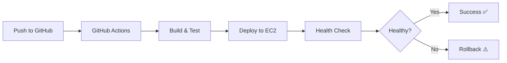

# Trevel Admin - Zero-Downtime Deployment

## 🎯 Overview

This backend now supports **zero-downtime deployments** with automated CI/CD via GitHub Actions.

## 🚀 Quick Start

### For Developers

1. Make your changes
2. Commit and push to `main` branch
3. GitHub Actions automatically deploys to EC2
4. No downtime, automatic rollback on failure

```bash
git add .
git commit -m "Your changes"
git push origin main
```

### For First-Time Setup

See [CICD_SETUP.md](./CICD_SETUP.md) for complete setup instructions.

## 📁 Project Structure

```
backend/
├── .github/
│   └── workflows/
│       └── deploy.yml          # GitHub Actions CI/CD workflow
├── scripts/
│   ├── deploy.sh              # Zero-downtime deployment script
│   ├── health-check.sh        # Health validation script
│   └── quick-deploy.sh        # Manual deployment helper
├── src/                       # Application source code
├── prisma/                    # Database schema and migrations
├── docker-compose.yml         # Docker configuration
├── Dockerfile                 # Container image definition
├── .env.example              # Environment variables template
└── CICD_SETUP.md             # Complete setup guide
```

## 🔧 Deployment Scripts

### `deploy.sh` - Zero-Downtime Deployment
Performs rolling updates with health checks and automatic rollback.

```bash
./scripts/deploy.sh
```

**Features:**
- ✅ Builds new Docker image with version tagging
- ✅ Starts new container before stopping old one
- ✅ Runs health checks before switching traffic
- ✅ Automatic rollback on failure
- ✅ Database migrations
- ✅ No downtime

### `health-check.sh` - Validate Deployment
Checks if the application is healthy and running correctly.

```bash
./scripts/health-check.sh
```

**Checks:**
- Container status
- Health endpoint (200 OK)
- API response
- Database connection
- Error logs
- Memory usage
- Disk space

### `quick-deploy.sh` - Manual Deployment
Quick deployment from EC2 when you need manual control.

```bash
./scripts/quick-deploy.sh
```

## 🔄 Deployment Workflow

### Automated (Recommended)



### Manual (When Needed)

```bash
# SSH to EC2
ssh -i trevel-key.pem ubuntu@YOUR_EC2_IP

# Navigate to backend
cd ~/backend

# Pull latest code
git pull origin main

# Deploy
./scripts/quick-deploy.sh
```

## 🏥 Health Checks

The application includes comprehensive health monitoring:

- **Endpoint**: `GET /healthz`
- **Expected Response**: `200 OK`
- **Checks**: Database connectivity, API responsiveness

## 🔐 Environment Variables

Copy `.env.example` to `.env` and configure:

```env
NODE_ENV=production
PORT=4000
DATABASE_URL=postgresql://...
JWT_SECRET=your-secret
AWS_REGION=ap-south-1
AWS_ACCESS_KEY_ID=your-key
AWS_SECRET_ACCESS_KEY=your-secret
AWS_S3_BUCKET=your-bucket
```

## 📊 Monitoring

### View Logs

```bash
# Container logs
docker logs trevel_admin_backend -f

# Last 100 lines
docker logs trevel_admin_backend --tail 100
```

### Check Status

```bash
# Container status
docker ps -f name=trevel_admin_backend

# Run health check
./scripts/health-check.sh
```

## 🐛 Troubleshooting

### Deployment Failed

1. Check GitHub Actions logs
2. SSH to EC2 and check container logs
3. Run health check script
4. Check `.env` file configuration

### Rollback to Previous Version

```bash
# SSH to EC2
ssh -i trevel-key.pem ubuntu@YOUR_EC2_IP

# Check if backup exists
ls -la ~/backend_old

# Restore backup
cd ~
rm -rf backend
mv backend_old backend
cd backend
./scripts/deploy.sh
```

### Container Won't Start

```bash
# Check logs
docker logs trevel_admin_backend

# Check environment variables
docker exec trevel_admin_backend env

# Restart container
docker restart trevel_admin_backend
```

## 📚 Documentation

- **[CICD_SETUP.md](./CICD_SETUP.md)** - Complete CI/CD setup guide
- **[EC2_DEPLOY_GUIDE.md](./EC2_DEPLOY_GUIDE.md)** - EC2 instance setup
- **[TROUBLESHOOTING.md](./TROUBLESHOOTING.md)** - Common issues and solutions

## 🎉 Benefits

### Before (Manual Deployment)
- ❌ Stop EC2 instance
- ❌ Manual file transfers via SCP
- ❌ Downtime during updates
- ❌ Manual container rebuilds
- ❌ No automatic rollback

### After (Automated CI/CD)
- ✅ Just `git push`
- ✅ Automatic deployment
- ✅ Zero downtime
- ✅ Automatic health checks
- ✅ Automatic rollback on failure
- ✅ Version tracking
- ✅ Persistent data

## 🔗 Related Resources

- [GitHub Actions Documentation](https://docs.github.com/en/actions)
- [Docker Documentation](https://docs.docker.com/)
- [Prisma Documentation](https://www.prisma.io/docs)

## 📝 License

MIT
